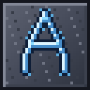

# ✨ AuraLite Realistic Crafting — Minecraft 1.20.1

**Copyright © 2026 AlexanderNyr** · License: **CC BY‑NC‑SA 4.0**

**1258 reworked recipes** — almost every vanilla craft is now more realistic.
Ships in **3 formats**: vanilla **datapack**, **Fabric** mod, **Forge** mod.



> 📜 **TL;DR license:** You may freely use, modify and redistribute this mod **with credit to AlexanderNyr** and **only for non‑commercial purposes**; derivative works must use the same license. Full text in `LICENSE.txt`. **Monetized YouTube/Twitch videos are fine** — see the Rules & Permissions section below.

---

## 📦 Downloads (`build/` folder)

| File | Where to put it | Requires |
|---|---|---|
| `AuraLiteRealisticCrafting-datapack-0.1.1.zip` | `<world>/datapacks/` | nothing — vanilla 1.20.1 client |
| `AuraLiteRealisticCrafting-fabric-0.1.1.jar`   | `.minecraft/mods/` | Fabric Loader 0.14+ |
| `AuraLiteRealisticCrafting-forge-0.1.1.jar`    | `.minecraft/mods/` | Forge 47+ |

> The datapack is a `.zip` (Minecraft data packs require this), while Fabric/Forge mods **must** be `.jar` files — the loaders ignore anything else in the `mods/` folder. All three files contain the same JSON recipes; only the manifest differs.

---

## 🚀 Installation

### Datapack (no mods needed, any 1.20.1 client)
1. Put `AuraLiteRealisticCrafting-datapack-0.1.1.zip` into `<world_folder>/datapacks/`.
2. Enter the world and run `/reload`. Verify with `/datapack list`.

### Fabric
1. Install [Fabric Loader 0.14+](https://fabricmc.net/use/installer/) for 1.20.1.
2. Drop `AuraLiteRealisticCrafting-fabric-0.1.1.jar` into `.minecraft/mods/`.
3. Launch the Fabric profile.

### Forge
1. Install [Forge 47.x](https://files.minecraftforge.net/) for 1.20.1.
2. Drop `AuraLiteRealisticCrafting-forge-0.1.1.jar` into `.minecraft/mods/`.
3. Launch. The mod registers via `lowcodefml` (pure data — no Java code).

Works on servers too — same file goes into the server's `mods/` folder or world `datapacks/` folder.

---

## 🛠 What changed (1258 recipes)

### 🪵 Wood (11 types: oak, spruce, birch, jungle, acacia, dark_oak, mangrove, cherry, crimson, warped, bamboo)
- **1 log → 6 planks** (realistic sawmilling)
- **3 planks → 9 slabs** (a slab is half a block — more makes sense)
- **6 planks → 8 stairs**
- Doors, trapdoors, fences, gates, buttons, pressure plates, signs, boats, chest‑boats — all rebalanced
- **Hanging signs** (1.20+) for every wood type
- **Bark stripping by crafting**: log + stick → stripped log

### ⛏ Tools (6 materials: wood, stone, iron, gold, diamond, netherite)
- All tools use a **stick handle**
- Metal/diamond/netherite tools **also require leather** for a grip wrap on the handle
- Pickaxes, axes, shovels, hoes, swords
- **Netherite upgrades** via smithing transform (vanilla path)

### 🛡 Armor
- **Leather** — classic, unchanged
- **Iron, gold, diamond** — require **leather padding** (gambeson) inside the metal frame
- **Diamond** — extra iron fittings on helmet & chestplate
- **Chainmail** — now craftable from **chains** (vanilla can't!)
- **Horse armor** (iron, gold, diamond) — now craftable (vanilla can't!)
- **Shield** — leather + iron rim
- **Turtle helmet, recovery compass** — full pipelines

### 🎨 16 colors — full coverage
For each of the 16 vanilla colors:
- **Concrete powder** (8 sand + dye → 8)
- **Dyed terracotta** (8 terracotta + dye → 8)
- **Glazed terracotta** via furnace + blast furnace
- **Stained glass + panes** (multiple paths)
- **Dyed wool, carpets, candles, beds, banners**
- **Shulker boxes** in all colors (and reset back to plain)
- **Candle cakes** for every color
- **Banner patterns** (Creeper, Flower, Skull, Mojang, Globe)

### 🌸 Dyes — every source
35+ recipes: flowers (single + tall), color mixing, bone meal, lapis lazuli, cocoa, ink sac, beetroot, dried kelp, etc.

### 🟧 Copper — every oxidation stage
- `cut_copper` in all 4 stages + slabs + stairs
- **Waxing** (12 recipes using honeycomb)
- **Lightning rod**

### 🧱 Stone (40+ blocks)
- **All slabs: 3 → 9** (was 6)
- **All stairs: 6 → 8** (was 4)
- **All walls: 6 → 9**
- **Chiseled variants** via 2 stacked slabs
- **Cracked variants** via smelting normal bricks
- **Polished, smooth, cut** variants rebalanced
- **Mossy variants** via moss block OR vine
- **Stonecutter** support: 100+ recipes across 17 stone families

### 🔥 Lighting & fire
- **Torch: coal on top of stick → 2 torches** (was 4)
- **Soul torch** (2 paths), **redstone torch**, **soul lantern**
- **Campfire**: sticks + log + coal
- **Lantern / soul lantern**: 8 nuggets around a torch
- **Candle**: string + honeycomb
- **TNT**: gunpowder cross + sand corners
- **Charcoal** from all 11 wood types (smelting)

### 🏠 Utility blocks
- **Crafting table**: 4 planks + 2 sticks (legs)
- **Furnace**: 8 cobblestone + clay ball (mortar) in the center
- **Blast furnace, smoker, smithing/cartography/fletching tables, loom, stonecutter** — realistic builds
- **Chest** with iron‑nugget hinges
- **Ender chest, shulker box, hopper, bucket, bowl** (clay-ceramic, not wood)
- **Barrel, lectern, bookshelf** (with actual books), **armor stand**
- **Decorated pot** (1.20+)
- **Chiseled bookshelf** (1.20+)

### ⚙ Redstone
- **Piston, sticky piston, observer**
- **Repeater, comparator** rebuilt with real torches
- **Redstone lamp, daylight detector**
- **Rails**: 24 per craft (was 16)
- **Activator, detector, powered rails** balanced for transport

### 🚂 Transport
- **Minecart**: 5 iron
- **All variants** (chest/furnace/hopper/TNT) — combined with the cart
- **Saddle**: leather + string + iron (2 different recipes)

### ⚔ Weapons
- **Bow**: sticks + string + **leather grip**
- **Crossbow**: sticks + iron + string + hook
- **Arrows**: flint + stick + feather → **8 arrows** (was 4)
- **Spectral arrows**: + glowstone dust
- **Fishing rod, flint and steel, shears**

### 🍞 Food
- **Bread**: 3 wheat + egg + water bucket → 2 bread
- **Cookie**: wheat + cocoa → 16 (bulk pattern)
- **Cake, pumpkin pie** with alternative recipes
- **Pumpkin pie, rabbit stew, mushroom/beetroot/suspicious stew** — ingredients revised
- **Golden apple/carrot, glistering melon** balanced
- **Hay** ↔ **wheat** both directions
- **Cooking** via furnace, smoker, and campfire for every meat/fish/potato

### 🪄 Magic / enchanting
- **Enchanting table**: book + 4 diamonds + 4 obsidian
- **Anvil, beacon, end crystal, conduit, brewing stand**
- **Reinforced deepslate** — now craftable from deepslate + echo + netherite!
- **Froglights** (all 3 colors) — glowstone + magma cream
- **Tinted glass, calibrated sculk sensor, recovery compass**

### 💎 Ingots ↔ blocks
- 9 materials (iron, gold, diamond, emerald, lapis, redstone, coal, netherite, copper) — block ↔ ingot, both ways
- Iron/gold nuggets — convertible both ways
- **Netherite ingot** craftable from 4 scrap + 4 gold
- **Amethyst block** ↔ **amethyst shard** both ways

### ♻️ Recycling
- **Blasting** iron/gold/chainmail armor and tools → nuggets
- **Diamond gear** → diamonds back
- **Netherite gear** → scrap back
- **Wool** (all 16 colors) → string

### 🎆 Fireworks
- **Rockets** of flight 1/2/3 with adjustable gunpowder
- **Firework star** base + all 16 colors

### 🪟 Glass, bars, chains
- **Glass pane, iron bars** with bulk recipes
- **Chain** (single + bulk)
- **Iron door** in bulk

### 🌿 Nature & extras
- **Packed/blue ice** craftable
- **Clay block, mud, packed mud, mud bricks**
- **Sculk** and **sculk vein** craftable
- **Pointed dripstone** ↔ **dripstone block** both ways
- **Soul soil** from soul sand
- **Cobweb → string** (9), **nether wart block** decompose

---

## ⚖️ Rules & Permissions (FAQ)

**Copyright © 2026 AlexanderNyr** — licensed under **CC BY‑NC‑SA 4.0**.

- **Videos & Streams:** You are free to showcase, stream, and use this datapack/mod in your videos — **including monetized channels on YouTube, Twitch, Kick, TikTok, etc.** Showing the mod in monetized content does **not** count as "commercial use" under this license. A mention/credit in the description is appreciated but not required.
- **Modpacks:** You are free to include this datapack/mod in your **free** modpacks on CurseForge, Modrinth, Technic, or any other platform. Please keep the original credit to **AlexanderNyr** in the modpack description.
- **Personal Tweaks:** You can freely modify the recipes / code for your own personal use, your own server, or your community.
- **No Re‑hosting:** Do **not** upload the raw files to third‑party download sites (especially behind ad‑links like AdFly, Linkvertise, and similar). Always link to the official authorized source.
- **Derivative Works:** If you modify this mod/datapack and **distribute** your version publicly, your release **must** be free, open‑source, and licensed under the exact same **CC BY‑NC‑SA 4.0** license, with clear attribution to the original author **AlexanderNyr**.
- **Commercial use:** Selling the mod, paywalling access to it, including it in **paid** modpacks/servers, or any other direct commercialization is **not allowed** without explicit written permission from the author.

### License at a glance

- ✅ **BY** — give credit: **AlexanderNyr** + a link to the project.
- 🚫 **NC** — non‑commercial use. Monetized video content **is allowed**; selling the mod/datapack itself **is not**.
- 🔁 **SA** — derivative works must be released under this same CC BY‑NC‑SA 4.0 license.

Full legal text: see `LICENSE.txt` or
<https://creativecommons.org/licenses/by-nc-sa/4.0/legalcode>.
Human‑readable summary: <https://creativecommons.org/licenses/by-nc-sa/4.0/>.

---

## 📁 Project structure

```
AuraLiteRealisticCrafting/
├── src/data/minecraft/recipes/    ← 1258 JSON recipe sources
├── scripts/
│   └── package.sh                 ← builds all 3 archives
├── formats/
│   ├── datapack/                  ← unpacked datapack contents
│   ├── fabric/                    ← unpacked Fabric mod contents
│   └── forge/                     ← unpacked Forge mod contents
├── build/
│   ├── AuraLiteRealisticCrafting-datapack-0.1.1.zip
│   ├── AuraLiteRealisticCrafting-fabric-0.1.1.jar
│   └── AuraLiteRealisticCrafting-forge-0.1.1.jar
├── pack.png                       ← 128×128 pixel-art "A" icon with aura
├── LICENSE.txt                    ← full CC BY-NC-SA 4.0 text
└── README.md
```

## 📝 Changelog

### v0.1.1
- **New recipes:**
  - `Brush` (1.20) — realistic archaeological brush: feather/stick/copper + alternate rabbit-hide variant
  - `Calibrated Sculk Sensor` — enhanced recipe requiring redstone tuning
  - `Recycle Brush` — dismantle brushes back into copper nuggets
  - `Recycle Spyglass` — dismantle spyglasses back into copper nuggets
  - `Recycle Compass / Clock` — dismantle back into iron/gold nuggets
  - `Recycle Saddle / Crossbow / Bow / Shears / Bucket / Flint & Steel` — smelting returns materials
  - `Recycle Lead` — unravel back into string
  - `Beehive` — realistic woodworking recipe with honeycomb
- **Build system:**
  - Added JSON validation and duplicate-ID detection in `scripts/package.sh`
  - Updated Fabric & Forge manifests with links, issue tracker and better metadata
  - `CHANGELOG.md` now ships inside every archive
- **Bug Fixes:**
  - `Enchanted Golden Apple` — corrected result item (was `golden_apple`, now `enchanted_golden_apple`)
  - `Anvil` — fixed recipe cost (was 7 iron blocks / 63 ingots, now 3 blocks + 4 ingots)
  - Removed duplicate recipes: `locator_map`, `white_wool_alt`, `empty_map_v2`
  - Removed misleading `apple_pie` recipe (produced `pumpkin_pie` under wrong filename)
- **Quality:**
  - All 1258 recipes validated for JSON correctness before packaging

### v0.1.0-beta
- Initial release with 1247 realistic recipes covering tools, armor, dyes, stone, redstone, food, transport, magic, recycling and more.

## 🔧 Rebuild from source

Want to tweak a recipe?

1. Edit a JSON file in `src/data/minecraft/recipes/`.
2. Run:
   ```bash
   bash scripts/package.sh
   ```
3. The built archives appear in `build/`.

## ⚙ Compatibility

- ✅ Minecraft **1.20.1** (pack_format 15)
- ✅ Fabric Loader 0.14+ / Forge 47+
- ✅ Server + client (sided = BOTH)
- ⚠️ Will conflict with other mods that override the **same** recipe IDs
- ℹ️ The in‑game recipe book picks up the new formulas automatically
